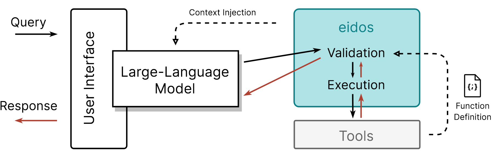

# eidos:  Validation and execution of AI functions

_eidos_ is an API for validating and executing AI functions. It aims to be a generic API to serve as a common interface to allow execution of functions by LLMs.



## Install

From source:

```bash
git clone git@github.com:KhaosResearch/eidos.git
cd eidos
python -m pip install -e .
```

Or directly from GitHub:

```bash
python -m pip install "eidos @ git+ssh://git@github.com/KhaosResearch/eidos.git"
```

## Deployment

* Development

Run the API with the following command:

```bash
uvicorn eidos.api:app --host 0.0.0.0 --port 8090 --reload
```

You can override the default configuration by setting [environment variables](src/eidos/settings.py).

* Docker

Alternatively, you can use the provided [Dockerfile](Dockerfile) to build a Docker image and run the API in a container:

```bash
docker build -t eidos-server:latest .
docker run -v $(pwd)/functions:/functions -p 8090:80 eidos-server:latest
```

Example:

```bash
curl -X POST -H "Content-Type: application/json" -d '{"who": "me"}' http://localhost:8090/api/v1/execution/salute
```

* Kubernetes

To deploy the container in Kubernetes, a reference deployment is available and documented at [deployments](deployments/).

* Serverless in AWS

# Semantic search of database of documents

Another docker image to deploy serverless in AWS Lambda is provided in [Dockerfile.lambda](Dockerfile.lambda). The image is based on the official AWS Lambda Python 3.11 image. For extending this image the process is the same as the main image.

```console
$ docker build -t eidos-lambda -f Dockerfile.lambda .
```

Run the container locally with the following command or deploy in AWS Lambda as a docker container image:
```bash
docker run --rm -p 9001:8080 eidos-lambda
```

Invoke the function for local testing with sample query
```bash
curl -XPOST "http://localhost:9001/2015-03-31/functions/function/invocations" -d '{"command": "EXECUTE", "parameters": {"function": "salute", "args": {"who": "me, I am executing serverless"}}}'
```

## Testing

`pytest` is used for testing. You can run the tests with the following command:

```bash
pytest tests/
```
